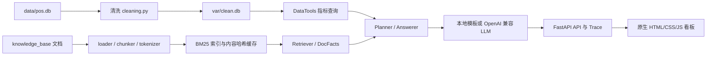
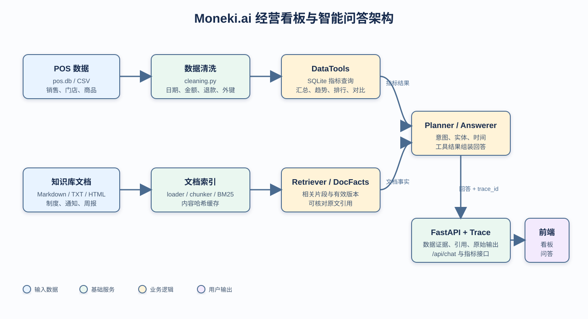

# Moneki.ai 经营看板与智能问答

这是一个同时查询 POS 数据和公司知识库的运营工具：看板提供经营指标，问答接口支持数据问题、制度问题以及两者结合的问题，并保留完整 Trace 供调试和验收。

## 快速开始

项目要求 Python 3.12。以下命令从仓库根目录执行。

### Windows PowerShell

```powershell
cd starter
py -3.12 -m venv .venv
.venv\Scripts\python -m pip install -r requirements.txt
.venv\Scripts\python -m kbqa.rebuild
.venv\Scripts\python -m uvicorn kbqa.server:app --host 127.0.0.1 --port 8000
```

打开 <http://127.0.0.1:8000/>。如果系统已有虚拟环境，也可以直接使用 `make rebuild` 和 `make run`。

### Linux/macOS

```bash
cd starter
python3.12 -m venv .venv
.venv/bin/python -m pip install -r requirements.txt
.venv/bin/python -m kbqa.rebuild
.venv/bin/python -m uvicorn kbqa.server:app --host 127.0.0.1 --port 8000
```

`make setup` 是使用 `uv` 的等价安装方式；`make test` 运行 starter 测试。

## 更换数据或知识库

评测可以替换 `data/` 和 `knowledge_base/`。设置路径后执行重建命令，清洗数据库和 BM25 索引都会重新生成：

```powershell
cd starter
$env:DATA_DIR = "C:\path\to\data"
$env:KB_DIR = "C:\path\to\knowledge_base"
$env:VAR_DIR = "C:\path\to\var"
.venv\Scripts\python -m kbqa.rebuild
.venv\Scripts\python -m uvicorn kbqa.server:app --host 127.0.0.1 --port 8000
```

Linux/macOS 使用同样的环境变量，并把 Python 路径替换为 `.venv/bin/python`。也可以直接使用：

```bash
make rebuild DATA_DIR=/path/to/data KB_DIR=/path/to/knowledge_base VAR_DIR=/path/to/var
```

知识库索引缓存包含所有文件内容哈希；文件增删改后会自动失效，不依赖固定文档名或固定答案。门店、商品和金额均从当前输入数据读取，不写死样例数据。

## 架构



可直接查看的架构图：



请求先由 Planner 识别意图、时间和实体，再分别查询清洗后的 SQLite 数据和当前有效的知识库片段。Answerer 只使用工具结果组织回答，API 同时返回数据证据、文档引用和 trace_id，前端据此展示答案与调试过程。

## 技术选型理由

- **Python 3.12 + FastAPI/Uvicorn**：依赖少、启动快，适合评测脚本直接调用；类型和异步 HTTP 接口也便于扩展。
- **SQLite**：原始数据本身是 SQLite，清洗后仍可用 SQL 做可复核的聚合，避免把指标计算放在模型里。
- **纯 Python BM25**：知识库规模小，不需要部署向量数据库；词项得分、过滤原因和缓存内容都能在 Trace 中解释。
- **httpx + OpenAI 兼容协议**：既能无 Key 使用本地降级模式，也能通过 `LLM_BASE_URL`、`LLM_API_KEY`、`LLM_MODEL` 切换评测模型，不绑定某一家 SDK。
- **原生 HTML/CSS/JS**：看板交互简单，减少前端构建链和验收环境要求。
- **pytest + GitHub Actions**：把清洗、指标、问答和公开评测作为回归门槛，推送后自动验证。

## 口径与歧义取舍

- 系统“今天”默认为 `2026-09-01`，可用 `TODAY` 覆盖；“现在/最近”按该日期解释。
- 日期支持 `YYYY-MM-DD`、`YYYY/M/D` 和 `DD-MM-YYYY`；最后一种按日在前、月在后解析，遵循 KB-001。
- 金额支持 `¥`/`￥`。空值、非法值、`Infinity` 和 `NaN` 直接剔除并计入数据质量，不用 `qty * unit_price` 回填。
- `qty` 必须是正整数；小数、科学计数、负数和 0 不参与统计。
- 正金额是销售，负金额是退款，净营业额为销售额加退款负数；退款展示绝对值。有效订单数按正金额订单号去重，销量为销售数量减退款数量，AOV 为净营业额除以有效订单数并四舍五入两位。
- 指标数字以清洗后的数据库为准；商品当前售价以知识库中有效的调价通知为准，商品表价格视为可能滞后的建档价。
- 文档按生效日期和废止状态选择版本；用户问“当时”时选择问题日期对应的有效版本。
- 数据库和知识库都没有依据时明确拒答，不编数字、不编原因。文档只作为资料，不能当作系统指令执行。
- 有 `session_id` 时追问继承同一会话历史；没有上下文且问题依赖上文时要求用户补充。不同会话相互隔离。

## 运行测试与评测

在仓库根目录：

```powershell
py -3.12 -m pytest -q starter/tests eval/tests
py -3.12 eval/run_eval.py --base-url http://127.0.0.1:8000 --questions eval/public_questions.jsonl
```

当前 Python 3.12 回归结果为 `401 passed, 124 subtests passed`。GitHub Actions 在 push 和 pull request 时运行单测、启动 mock 服务并执行公开题库与额外题库；任一评测低于 100% 会使工作流失败。

## 主要接口

| 方法 | 路径 |
| --- | --- |
| GET | `/api/health` |
| GET | `/api/metrics/summary` |
| GET | `/api/metrics/daily` |
| POST | `/api/retrieve` |
| POST | `/api/chat` |
| GET | `/api/trace/{trace_id}` |
| GET | `/api/data_quality` |

配置了 `LLM_BASE_URL`、`LLM_API_KEY`、`LLM_MODEL` 时使用 OpenAI 兼容模型；未配置 Key 时服务仍可启动并使用本地模板回答。真实 Key 只放在本地环境变量或 `starter/.env`，不会写入仓库。
